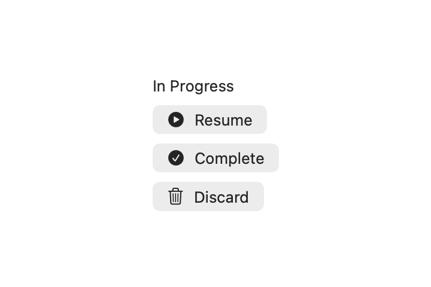

# WorkoutSessionKit

App-agnostic driver for a rounds x slots workout with per-segment timing (hold /
per-side / slices). The engine owns the clock, phase, and cue emission; the host app
owns persistence and progression via the value snapshots it feeds in.

## Components

<!-- SCREENSHOTS:START -->
| Component | Preview |
| --- | --- |
| `InProgressSessionControls` |  |
<!-- SCREENSHOTS:END -->

## Requirements

- iOS 17+ / macOS 14+
- Swift 5.9+

## Installation

```swift
.package(url: "https://github.com/sphericalwave/WorkoutSessionKit.git", branch: "main")
```

## Overview

- `WorkoutSessionEngine` — the driver. Typical loop:
  ```swift
  engine.start()                        // begins slot 0
  // ...runs left 30s -> cue(.segmentBoundary) -> right 30s -> cue(.slotEnd)...
  phase == .awaitingLog                 // app shows its log sheet
  // ...app persists the set + applies progression...
  engine.advance()                      // -> next slot / round / finished
  ```
  Or unattended, for a guided routine that records itself and has no log
  sheet to stop at:
  ```swift
  let engine = WorkoutSessionEngine(
      totalRounds: 3,
      autoAdvance: true,                // slot -> slot -> round -> finished
      slotsForRound: { _ in postures },
      speak: { audio.speak($0) }
  )
  engine.start()
  ```
- `WorkoutSlot` — a value snapshot of the exercise to perform in one slot of a round; apps build these from their own model types, the engine never sees SwiftData/CoreData
- `TimingMode` — hold / per-side / slices / named-segment timing for a slot.
  `.segments(names: ["Right", "Centre", "Left"], seconds: 60)` runs one hold
  per name, announced by name — for a posture a left/right pair can't express
- `SessionCue` — cues emitted by the engine (segment boundary, slot end, etc.)
- `SessionClock` — where the engine gets time. `.realtime` in an app, or the
  `sleepNanos:` seam to run a whole session instantly in a test. What's left
  of a segment is derived from elapsed time rather than decremented once per
  sleep, so a long hold can't drift past its target
- `pause()` / `resume()` — stall a segment without losing the seconds left
- `InProgressSessionControls` — SwiftUI controls for an in-progress session

## Dependencies

None.
